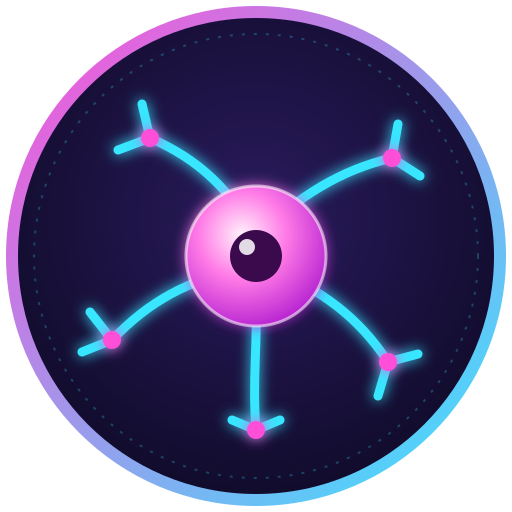

<p align="center">
  
</p>

# Last Brain Cell (BRAIN)

An ERC-20 meme coin contract for EVM-compatible networks.

## Token properties

- Name: `Last Brain Cell`
- Symbol: `BRAIN`
- Decimals: 18
- Fixed supply: 1,000,000,000 BRAIN
- All tokens are minted once to the non-zero `initialHolder` passed to the constructor.
- No owner, post-deployment minting, transfer tax, blacklist, or upgrade mechanism.

The contract does not deploy itself, select a network, provide liquidity, or make any claim
about the token's value. Review the deployment address and network carefully before deploying.

## Requirements

- [Foundry](https://book.getfoundry.sh/getting-started/installation)
- Git

## Install and test

```sh
git clone --recurse-submodules https://github.com/Mamiche/last-brain-cell.git
cd last-brain-cell
forge test
```

OpenZeppelin Contracts v5.4.0 is included as a pinned Git submodule under `lib/openzeppelin-contracts`.

## Build

```sh
forge build
```

## Deploy

Always rehearse on a testnet (e.g. Sepolia) before mainnet. Use a dedicated wallet and import its
key into Foundry's encrypted keystore instead of putting it in a file or command line:

```sh
cast wallet import deployer --interactive
```

Dry run (local simulation, no transaction sent):

```sh
export INITIAL_HOLDER=0xYourAddress   # PowerShell: $env:INITIAL_HOLDER="0xYourAddress"
forge script script/Deploy.s.sol:Deploy
```

Deploy and verify (requires an RPC URL and an Etherscan API key):

```sh
forge script script/Deploy.s.sol:Deploy \
  --rpc-url <RPC_URL> --account deployer --broadcast \
  --verify --etherscan-api-key <ETHERSCAN_API_KEY>
```

`INITIAL_HOLDER` receives the entire fixed supply; prefer a hardware wallet or multisig. This
repository intentionally contains no private keys or RPC credentials.
